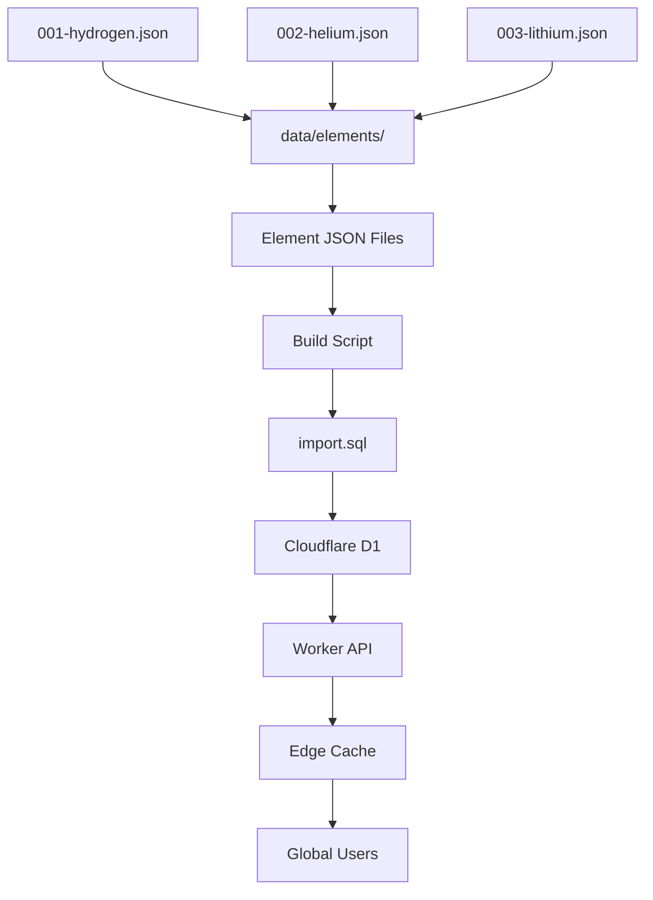

# Hydrogen Periodic Table API

[](https://opensource.org/licenses/MIT)
[](https://workers.cloudflare.com/)
[](https://developers.cloudflare.com/d1/)
[](https://github.com/mdtahur23/hydrogen)

A comprehensive, open-source periodic table API built with modern serverless architecture. Access detailed information about all 118 chemical elements with advanced filtering capabilities, edge caching, and global performance.

**🚀 Live API:** [https://hydrogen.mdtahur23.workers.dev](https://hydrogen.mdtahur23.workers.dev)

---

## ✨ Features

- **🌍 Global Edge Network**: Sub-100ms response times worldwide via Cloudflare Workers
- **🔍 Advanced Filtering**: Query elements by category, physical state, period, block, and properties
- **📊 Comprehensive Data**: Complete element information including physical properties, uses, and sources
- **🚀 High Performance**: Intelligent caching and optimized database queries
- **🔒 CORS Enabled**: Ready for browser applications and cross-origin requests
- **📱 RESTful Design**: Clean, intuitive API endpoints following REST principles
- **🆓 Open Source**: Community-driven with transparent data sources

---

## 📋 Table of Contents

- [Quick Start](#-quick-start)
- [API Endpoints](#-api-endpoints)
- [Filtering & Search](#-filtering--search)
- [Response Format](#-response-format)
- [Examples](#-examples)
- [Architecture](#-architecture)
- [Local Development](#-local-development)
- [Contributing](#-contributing)
- [License](#-license)

---

## 🚀 Quick Start

### Test the API
```bash
# Get hydrogen (element #1)
curl https://hydrogen.mdtahur23.workers.dev/elements/1

# Get oxygen by symbol
curl https://hydrogen.mdtahur23.workers.dev/elements/symbol/O

# Get all noble gases
curl "https://hydrogen.mdtahur23.workers.dev/elements?category=noble-gas"

# API documentation
curl https://hydrogen.mdtahur23.workers.dev/api
```

### JavaScript Integration
```javascript
const API_BASE = 'https://hydrogen.mdtahur23.workers.dev';

// Fetch element by atomic number
async function getElement(atomicNumber) {
  const response = await fetch(`${API_BASE}/elements/${atomicNumber}`);
  if (!response.ok) throw new Error('Element not found');
  return response.json();
}

// Search elements with filters
async function searchElements(filters = {}) {
  const params = new URLSearchParams(filters);
  const response = await fetch(`${API_BASE}/elements?${params}`);
  return response.json();
}

// Usage examples
const hydrogen = await getElement(1);
const nobleGases = await searchElements({ category: 'noble-gas', limit: 6 });
const liquidElements = await searchElements({ state: 'liquid' });
```

---

## 🌐 API Endpoints

### Core Endpoints

| Method | Endpoint | Description |
|--------|----------|-------------|
| `GET` | `/elements` | List all elements with optional filtering |
| `GET` | `/elements/{number}` | Get element by atomic number (1-118) |
| `GET` | `/elements/symbol/{symbol}` | Get element by symbol (case-insensitive) |
| `GET` | `/elements/name/{name}` | Get element by name (case-insensitive) |

### Discovery Endpoints

| Method | Endpoint | Description |
|--------|----------|-------------|
| `GET` | `/elements/categories` | List all element categories |
| `GET` | `/elements/liquid` | Elements that are liquid at room temperature |
| `GET` | `/elements/gas` | Elements that are gas at room temperature |
| `GET` | `/api` | API information and usage examples |

---

## 🔍 Filtering & Search

### Basic Filters

| Parameter | Type | Description | Example |
|-----------|------|-------------|---------|
| `group` | Integer | Filter by periodic group (1-18) | `?group=17` |
| `category` | String | Filter by element category | `?category=noble-gas` |
| `state` | String | Filter by standard state | `?state=liquid` |
| `period` | Integer | Filter by period (1-7) | `?period=3` |
| `block` | String | Filter by electron block (s, p, d, f) | `?block=d` |
| `limit` | Integer | Limit number of results (1-118) | `?limit=10` |

### Property Filters

| Parameter | Type | Description | Example |
|-----------|------|-------------|---------|
| `meltingPoint` | Number | Elements with melting point > value (K) | `?meltingPoint=1000` |
| `boilingPoint` | Number | Elements with boiling point > value (K) | `?boilingPoint=373` |
| `density` | Number | Elements with density > value (g/cm³) | `?density=5` |

---

## Filtering: Valid Categories

Categories are always lowercase and use dashes for multi-word groups.

| Category                 | Description                        |
|--------------------------|------------------------------------|
| alkali-metal             | Group 1 (Li, Na, K, Rb, Cs, Fr)    |
| alkaline-earth-metal     | Group 2 (Be, Mg, Ca, Sr, Ba, Ra)   |
| transition-metal         | Groups 3–12 (periodic block d/f)   |
| post-transition-metal    | Certain metals just right of d-block|
| metalloid               | B, Si, Ge, As, Sb, Te, Po          |
| nonmetal                 | H, C, N, O, P, S, Se               |
| halogen                  | Group 17 (F, Cl, Br, I, At, Ts)    |
| noble-gas                | Group 18 (He, Ne, Ar, Kr, Xe, Rn, Og) |
| lanthanide               | Elements 57–71                     |
| actinide                 | Elements 89–103                    |
| unknown                  | Undiscovered or unclassified       |

**Note:**  
Some superheavy elements (atomic number ≥109) may be labeled as `"unknown"` if not definitively classified.

---

## 📊 Response Format

### Single Element Response

```json
{
  "atomicNumber": 1,
  "symbol": "H",
  "name": "Hydrogen",
  "category": "diatomic nonmetal",
  "period": 1,
  "block": "s",
  "atomicMass": 1.008,
  "standardState": "gas",
  "densityValue": 0.08988,
  "densityConditions": "0°C, 1 atm",
  "meltingPointValue": 13.99,
  "meltingPointUnit": "K",
  "boilingPointValue": 20.271,
  "boilingPointUnit": "K",
  "electronegativity": 2.2,
  "electronConfiguration": "1s1",
  "discoveredBy": "Henry Cavendish",
  "discoveryYear": 1766,
  "summary": "Hydrogen is a colorless, odorless, tasteless, non-toxic, highly combustible diatomic gas and the most abundant element in the universe.",
  "oxidationStates": [1, -1],
  "uses": [
    "ammonia synthesis",
    "rocket fuel",
    "petroleum refining"
  ],
  "sources": [
    "water electrolysis",
    "natural gas reforming"
  ],
  "groupNumber": 1
}
```

### List Response

```json
[
  {
    "atomicNumber": 1,
    "symbol": "H",
    "name": "Hydrogen",
    // ... other properties
  },
  {
    "atomicNumber": 2,
    "symbol": "He", 
    "name": "Helium",
    // ... other properties
  }
]
```

### Error Response

```json
{
  "error": "Element not found"
}
```

---

## 💡 Examples

### Basic Queries

```bash
# Get specific elements
curl https://hydrogen.mdtahur23.workers.dev/elements/6                    # Carbon
curl https://hydrogen.mdtahur23.workers.dev/elements/symbol/Au           # Gold
curl https://hydrogen.mdtahur23.workers.dev/elements/name/oxygen         # Oxygen

# List elements with basic filters
curl "https://hydrogen.mdtahur23.workers.dev/elements?group=1&limit=3"   # First 3 alkali metals
curl "https://hydrogen.mdtahur23.workers.dev/elements?period=2"          # Second period elements
```

### Advanced Filtering

```bash
# Filter by category
curl "https://hydrogen.mdtahur23.workers.dev/elements?category=transition-metal&limit=5"

# Filter by physical state
curl "https://hydrogen.mdtahur23.workers.dev/elements?state=gas"

# Filter by electron configuration block
curl "https://hydrogen.mdtahur23.workers.dev/elements?block=f&limit=10"  # f-block elements

# Combine multiple filters
curl "https://hydrogen.mdtahur23.workers.dev/elements?period=4&block=d&limit=5"

# Property-based filtering
curl "https://hydrogen.mdtahur23.workers.dev/elements?density=10"        # Dense elements
curl "https://hydrogen.mdtahur23.workers.dev/elements?meltingPoint=2000" # High melting point
```

### Discovery Endpoints

```bash
# Explore element categories
curl https://hydrogen.mdtahur23.workers.dev/elements/categories

# Get elements by state
curl https://hydrogen.mdtahur23.workers.dev/elements/liquid
curl https://hydrogen.mdtahur23.workers.dev/elements/gas
```

### Real-World Use Cases

```javascript
// Educational app: Get all halogens
const halogens = await fetch('https://hydrogen.mdtahur23.workers.dev/elements?group=17')
  .then(res => res.json());

// Chemistry tool: Find metals with high density
const denseMetals = await fetch('https://hydrogen.mdtahur23.workers.dev/elements?density=15')
  .then(res => res.json());

// Materials science: Third period transition metals
const materials = await fetch('https://hydrogen.mdtahur23.workers.dev/elements?period=4&block=d')
  .then(res => res.json());
```

---

## 🏗️ Architecture



### Technology Stack

- **Frontend**: Cloudflare Workers (V8 JavaScript Runtime)
- **Database**: Cloudflare D1 (SQLite-compatible, globally replicated)
- **Caching**: Cloudflare Edge Cache (1-hour TTL)
- **Build System**: Node.js with custom JSON-to-SQL conversion
- **Deployment**: Wrangler CLI with automated CI/CD

### Data Flow

1. **Element data** stored as individual JSON files in `data/elements/`
2. **Build script** converts JSON files to SQL import statements
3. **Database import** populates normalized D1 tables
4. **Worker API** serves data with intelligent caching
5. **Global distribution** via Cloudflare's edge network

### Database Schema

**Main Table:**
- `elements` - Core element properties (atomicNumber, symbol, name, category, physical properties)

**Normalized Relations:**
- `oxidation_states` - Element oxidation states (1:many)
- `element_uses` - Practical applications (1:many)
- `element_sources` - Natural/artificial sources (1:many)
- `element_attributions` - Data source citations (1:many)

---

## 🔨 Local Development

### Prerequisites

- Node.js 18+
- [Wrangler CLI](https://developers.cloudflare.com/workers/wrangler/install-and-update/)
- Cloudflare account with D1 database access

### Setup

```bash
# Clone the repository
git clone https://github.com/mdtahur23/hydrogen-api.git
cd hydrogen-api

# Install dependencies
npm install

# Login to Cloudflare
wrangler login

# Create D1 database
wrangler d1 create hydrogen-db
```

### Development Workflow

```bash
# 1. Validate element data
npm run validate

# 2. Generate SQL import from JSON files
npm run import-d1

# 3. Create database schema
npm run schema:create

# 4. Import element data  
wrangler d1 execute hydrogen-db --local --file=import.sql

# 5. Start local development server
wrangler dev --local

# 6. Test your changes
curl http://localhost:8787/elements/1
```

### Production Deployment

```bash
# Deploy database schema
npm run schema:create:remote

# Import production data
npm run deploy-data:remote

# Deploy the Worker
npm run deploy
```

### Available Scripts

| Command | Description |
|---------|-------------|
| `npm run validate` | Validate all JSON element files |
| `npm run import-d1` | Generate import.sql from JSON data |
| `npm run schema:create` | Create D1 schema (local) |
| `npm run schema:create:remote` | Create D1 schema (production) |
| `npm run deploy-data:remote` | Import data to production D1 |
| `npm run deploy` | Deploy Worker to production |

---

## 🤝 Contributing

We welcome contributions from the chemistry and developer communities!

### Ways to Contribute

- **Add missing elements** or improve existing data
- **Fix data inaccuracies** with proper scientific sources
- **Enhance API functionality** with new endpoints or filters
- **Improve documentation** and examples
- **Report bugs** or suggest features

### Adding/Updating Element Data

1. **Fork the repository**
2. **Edit or create element files** in `data/elements/`
   ```json
   // data/elements/001-hydrogen.json
   {
     "atomicNumber": 1,
     "symbol": "H",
     "name": "Hydrogen",
     // ... complete element data
   }
   ```
3. **Validate your changes**
   ```bash
   npm run validate
   npm run import-d1
   ```
4. **Submit a pull request** with detailed description

### Development Guidelines

- Follow the existing JSON schema structure
- Include proper scientific sources for data changes
- Test locally before submitting PRs
- Write clear commit messages
- Update documentation for new features

### Data Sources

All element data should be sourced from reputable scientific databases:
- NIST (National Institute of Standards and Technology)
- IUPAC (International Union of Pure and Applied Chemistry)

---

## 📈 Performance

### Response Times
- **Edge cached responses**: < 50ms globally
- **Database queries**: < 100ms average
- **Complex filtered queries**: < 200ms

### Rate Limits
- **Current**: No rate limiting (fair use policy)
- **Planned**: 1000 requests/hour for free tier

### Caching Strategy
- **Static endpoints**: 1-hour edge cache
- **Filtered queries**: Smart caching based on query complexity
- **Cache invalidation**: Automatic on deployments

---

## 🔮 Roadmap

### Version 1.2 
- [ ] GraphQL endpoint for advanced queries
- [ ] TypeScript definitions and SDK
- [ ] Enhanced error handling and validation
- [ ] API usage analytics


---

## 📄 License

This project is licensed under the MIT License - see the [LICENSE](LICENSE) file for details.

```
MIT License

Copyright (c) 2024 mdtahur23 and contributors

Permission is hereby granted, free of charge, to any person obtaining a copy
of this software and associated documentation files (the "Software"), to deal
in the Software without restriction, including without limitation the rights
to use, copy, modify, merge, publish, distribute, sublicense, and/or sell
copies of the Software, and to permit persons to whom the Software is
furnished to do so, subject to the following conditions:

The above copyright notice and this permission notice shall be included in all
copies or substantial portions of the Software.
```

---

## 🙏 Acknowledgments

- **Scientific Community**: For maintaining accurate periodic table data
- **Cloudflare**: For providing excellent serverless infrastructure
- **Contributors**: Everyone who helps improve the API and data quality
- **Educational Institutions**: For validating scientific accuracy

---

## 📞 Support

- **GitHub Issues**: [Report bugs or request features](https://github.com/mdtahur23/hydrogen/issues)
- **Documentation**: [Complete API documentation](https://hydrogen.mdtahur23.workers.dev/api)


---

**🚀 Live API:** [https://hydrogen.mdtahur23.workers.dev](https://hydrogen.mdtahur23.workers.dev)  
**📚 Documentation:** [https://hydrogen.mdtahur23.workers.dev/api](https://hydrogen.mdtahur23.workers.dev/api)  
**💻 Source Code:** [https://github.com/mdtahur23/hydrogen](https://github.com/mdtahur23/hydrogen)